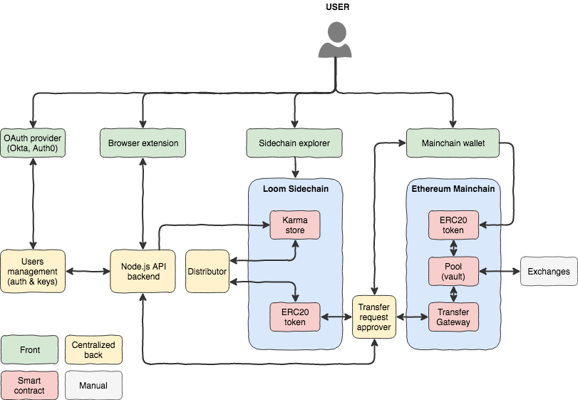

# Ecosystem architecture

## On the Use of Blockchain

Hey aims at bringing value to its community using the best technology stack available. We make technology decisions pragmatically, avoiding hype bias. With this in mind, the Hey team selected Blockchain to support core functionalities of our product.

We understand that the decision might be polarizing, but have strong rationales for such a choice and have thoroughly pressure-tested possible consequences. Ultimately, we feel confident that Blockchain is the way to go for Hey. Here's why:

### Security and Transparency

The Hey community as a whole will ultimately generate value for its members, as well as for other stakeholders \(e.g. advertisers\) who bear interest in capturing its attention. We recognize this value and  have chosen to monetize it via the HEY token. Overtime, as the community grows, so will the value for all stakeholders.

It is important to us that users can enjoy maximum protection while exercising control over the value they generate. With built-in cryptographic controls, Blockchain allows the entire Hey community to enjoy the most secure environment modern technology can provide.

It's equally important for all to see that Hey's internal team is not reaping unfair benefits from value generated by the community. Using Blockchain-based smart contracts ensures that incoming flows of value \(e.g. advertising fees\) are proportionally redistributed between all stakeholders. The contracts automatically monitor and enforce such distribution, so Hey's internal team is taken out of the equation altogether, leaving no room for corruption of any kind. 

These elements of security and transparency are core to the Hey product, and we've found Blockchain to be the only off-the-shelf technology that allows us to include these features with a sufficient level of stability and developer-friendliness.

### Efficient Assets and Transactions Management

All community contributions within the Hey ecosystem are rewarded with HEY tokens. This gives rise to a significant number of micro-transactions throughout the network.

Given the transaction fees and complexity associated with fiat currency, managing value flows with fiat is clearly a no-go here. Rather, we need to rely on an alternate form of currency that can easily handle asset and transaction management. In this respect, Blockchain's built-in support for both issues makes it a very attractive tool to handle Hey's value flows. 

In addition to assisting with asset and transaction management, we believe that using Blockchain will significantly accelerate Hey's growth velocity. Thanks to the built-in functionalities outlined above, there's no need to build a value protocol ourselves. This will save a significant amount of man-hours and other valuable resources. Blockchain allows us, instead, to focus on building new, more specific features to captivate and engage our users.

### Aligned Technical and Social Incentives

Blockchain's unique advantages of security and transparency are due in part to its distributed nature. In addition to the aforementioned technical advantages, decentralized technology has positive repercussions for Hey's community dynamics. Its important to us that the product be owned by its users and for users to serve as catalysts for early adoption in their social circles. Allowing users to run their own Blockchain node—and be rewarded for it—makes this aspiration attainable and accelerates the community's growth potential. For individuals who may not have been initially inclined to participate in the Hey community as an active user, the opportunity to run a node proves appealing for its prospective reward, and so increases momentum of community growth. 

Based on the advantages noted above, we believe that Blockchain constitutes a powerful asset for Hey. Like past and present peer-to-peer communities \(Napster and BitTorrent, among others\), Hey will benefit from a favorable combination of technical and social incentives.

### A Note on Tech Maturity

While its virtues are abundant, we understand that Blockchain remains an emerging technology. Our team of seasoned techies anticipates big changes down the road, along with the occasional vulnerability and rough patch—all of which are part of a technology's journey to maturity.

To ensure that we don't land in any tech dead-ends, we'll conduct continual test-and-learn experiments and, as we feel the technology is reaching maturity, will gradually transfer increasing amounts of the Hey stack to the Blockchain.

## On the Use of Ethereum and Loom Network

We have chosen to build Hey on two Blockchains using the Ethereum protocol. More explicity: social interactions are recorded on a Dapp Chain powered by the [Loom Network](https://loomx.io/developers/en/) \(a sidechain\). These social interactions generate value for the users in the form of sidechain HEY tokens. At anytime, users can transfer their tokens from the sidechain to the Ethereum mainchain, where these tokens have a tradeable value. Note that the ICO will be conducted on the Ethereum mainchain. 

### Ethereum

When selecting the Blockchain protocol supporting Hey's product, Ethereum quickly emerged as the best option on the market. At the moment, it is the only protocol combining the following features:

* Public network
* Smart contracts and DApps support
* Battle-tested and widely adopted tokens protocol \(e.g., ERC20\)
* Developer friendliness \(i.e., good documentation and broad community\)
* Availability of talent \(i.e., developers and auditors\)
* Development status and stability of protocol \(i.e., all features available on the live network\)

After extensive analysis of several alternative protocols, we concluded that Ethereum stood out as the best fit for Hey. With [1,750+](https://www.stateofthedapps.com/) DApps \(and counting\) officially running on the protocol, we reckon that Ethereum has proven itself as the go-to for products striving toward wide community adoption. 

### Sidechains

For all its qualities, Ethereum still suffers from well-know limitations. If not confronted, these could prove significant obstacles to Hey's development. The principal issue is scalability and corresponding network congestion challenges: all applications running on the main Ethereum Blockchain consume the same resources, and so become competitors in regard to confirming transactions. From a technological standpoint, we don't believe this makes sense—a variation in activity renders it unsuitable. Consider the ever-famous Ethereum kitty example: "Why would the breeding of kitties happen on the same environment and with the same military-grade security as a multimillions monetary transfer between two exchanges?"

Several solutions are under development to tackle the issue, including [Casper](https://arxiv.org/abs/1710.09437) and [Plasma](https://plasma.io/). After some R&D, we've found that sidechains like Plasma prove particularly useful for Hey.

Sidechains allow DApps to run their business logic on bespoke networks, connecting back to the mainchain only when users wish to transfer or redeem the value harvested on the sidechain. The reverse operation is also supported, wherein users can lock value on the mainchain during the period in which it is being employed on a sidechain. This would be the case, for example, with crypto-collectibles transported from one sidechain to another—in this instance, the mainchain would function as a middle man between sidechains, and value would remain locked until being returned to the mainchain.

In Hey's case, transfers will initially be feasible solely one-way: from the sidechain to the mainchain. That is, users will earn tokens for their activity on the sidechain before redeeming them for publicly tradeable tokens on the mainchain. In a much later phase—likely a few years from the ICO—we will also permit the transfer of value from the mainchain to the sidechain \(e.g. for in-app purchases\).

### Loom Network

Within the Ethereum universe, the [Loom](https://loomx.io/) team \(and creators of the [CryptoZombies Solidity Tutorials](https://cryptozombies.io/)\) have done a tremendous job increasing expertise in the developers' community.

The team constantly acquires feedback from developers, so has established a solid \(and well-founded\) understanding of community requests. More particularly, they have recognized the appeal to make Ethereum more developer-friendly, as well as capable of running informal DApps, such as games and social networks. 

The [Loom Network ](https://loomx.io/developers/)is "_a Layer 2 scaling solution for Ethereum that is live in production. It is a network of DPoS sidechains, which allows for highly-scalable games and user-facing DApps while still being backed by the security of Ethereum._"

This Etherum hard fork is specifically targeted at games and social networks \(e.g. [DelegateCall](https://delegatecall.com/newest)\). This, combined with the Loom team's regular release of new features, has convinced our team that the Loom Network is the best technological fit for Hey's sidechain.

## On the Hey App Architecture

Hey is a simple product powered by an ecosystem of applications and services, some of which are centralized while others run on the Blockchain. This section outlines the main components of the ecosystem's architecture.

### Development Philosophy

As the Hey community continues to evolve, so will the Hey product. This evolution is intended to suit the changing needs of the community and to engage and excite them with new, unique features. Part of the deal is also to have some fun. Our development team loves nothing more than testing and learning, experimenting, and failing fast—these are known to be the winning ingredients in crafting successful software products. Not to worry: failures will be finished in the testing phase, well before any new features are added to the Hey platform. 

Throughout the development process, our aim is to combine agility with what can prove to be laborious specifics of Blockchain technology. While we reckon this will prove challenging at times, we feel confident that we can strike a balance between speed, flexibility, and attention to detail. Our guiding principle will be trust and follow-through: that is, an understanding that the Hey community has put their confidence in our team and that we are committed to satisfying their needs. We believe that maintaining a mutual trust—including ours in the community—will help us to make sound decisions throughout the growth process \(e.g. when contemplating a fork\).

With trust at the forefront of our practice, we plan to open-source all centralized parts of the Hey product. At the same time, it is necessary to strike a balance between community transparency and the security of the product. We will do our best to find the compromise that maximizes openness and honesty with the Hey community as well as bypasses security challenges faced in the initial product development stage.

### Beta Release vs. Vision

In the sections that follow, we have chosen to distinguish between the Beta release architecture and our ultimate vision for the Hey product. This distinction is made in order to offer the utmost transparency regarding Hey's maturation process and to highlight the growth to come. 

The aim of Hey's Beta release is to get the \(public\) ball rolling as soon as possible.The sooner we can demonstrate community adoption, the better. We feel that Hey's Beta version provides a set of core features simple enough to remain agile in terms of development, while powerful enough to yield user retention." 

We present the long-term vision in the hopes that our intended growth and ambitious development path will excite and engage early adopters.

The timing of the successive releases is detailed in the Roadmap section of this whitepaper.

### Beta Release Architecture Overview

The Beta release architecture is a mix of centralized and \(decentralized\) Blockchain-based components, which can be broadly grouped into three categories:

* **Front-ends**: these are the user interfaces of each system noted in the figure above. 
  * The key user interface is the **browser extension**. This is where users will spend the majority of their time. The extension will be available on all main browsers \(including Chrome, Safari, and Firefox\), and will be released and maintained by the Hey team. The extension interacts loosely with the back-end, implying that any community member can build a front-end on top of Hey's backend. 
  * The **OAuth provider** interface is an authentication page that will enable users to link social accounts with their Hey profile for simpler, streamlined account management.
  * The **Sidechain explorer** will allow users to monitor the sidechain in real time and see how their social interactions are engraved into blockchain transactions that will ultimately generate value \(HEY tokens\) for other users \(e.g. those users whose content they have liked\). ****The sidechain will also allow any individual to check another user's ****sidechain tokens balance in order to prove their involvement in the Hey community.
  * The **Mainchain Wallet** can be any Ethereum compatible wallet \(e.g. MetaMask or MEW\). The Mainchain wallet allows users to control their mainchain HEY tokens similarly to any other ERC20 tokens.
* **Smart contracts**: the Blockchain-based components of the Beta architecture.
  * **Sidechain smart contracts** will record and store user-generated value—based on their activity on the platform—in the application. ****The Beta release will focus on allowing users to earn Karma every time peers recognize their contributions to the community—be it via likes, comments, or otherwise. Sidechain ERC20 tokens will then be distributed periodically based on Karma points earned during the given period \(token distribution is outlined in **NOTED SECTION\)**.
  * **Mainchain smart contracts** will manage the publicly tradeable HEY ERC20 tokens, which will be generated during the ICO. In addition to the standard ERC20 smart contracts \(including a pool of tokens set aside for the community\), the Hey team has developed a Transfer Gateway contract similar to that used by the [DelegateCall](https://delegatecall.com) application. This contract will allow users to redeem HEY tokens on the mainchain as long as they have received approval from the sidechain.
* **Centralised back-end services**: these are the components of the Beta architecture that we have chosen not to port to the Blockchain just yet. Some components will be ported \(**???\)** once we've obtained additional user feedback, while others won't be ported at all—that is, when it doesn't make much sense from a tech perspective.
  * The **Node.js API backend** is Hey's core application server and handles most of our business logic. It stores and retrieves the content of messages, serves assets, and sets users product preferences, among other activities. The Node.js backend relies on a NoSQL DB for data storage. Each time a value-generating event is recorded on the server \(i.e. social interactions such as likes and follows\), a corresponding blockchain transaction will be emitted \(and signed using the user's private key\). This real-time display of actions on the Blockchain can be monitored by users at all times using the Sidechain explorer, offering a level of transparency that will prove helpful in maintaining the community's trust.
  * The **Users management** is the particularly secure service that will manage Hey users' sidechain accounts—it isn't exposed on the Internet, but rather is only made accessible only via other back-end components. For each user account, the Users management is responsible for generating and securely storing the user's sidechain private and public keys, along with his/her sidechain address. Once a user is authenticated and verified by the Node.js API backend, that user's data is accessible only by  him/herself. Providing this service in the back-end allows users to delegate certain tasks to said back-end \(e.g. signing sidechain transactions\), resulting in increased efficiency and ergonomy. Our team's long-term vision is to allow users to sign transactions directly via the front-end, reading their private key from their local machine storage.
  * The **Distributor** is the service that periodically assesses how many Karma points have been earned by each user during a given the period in order to distribute sidechain HEY tokens accordingly. The rules the Distributor follows are described in the HEY token section of this paper. We have opted not to port this service to the Blockchain just yet, so that our developers can experiment, receive community feedback, and make changes accordingly. Despite its current centralized nature, there should be no concern about transparency—the input \(Karma\) and output \(sidechain HEY tokens\) of the distribution algorithm are stored on-chain, so the community can always verify if the claimed implementation is respected. In order to enable this audit at any time, the full source code of the distributor will be made open-source. 
  * The **Transfer Request Approver** is the middleware that will allow users ****to redeem sidechain HEY tokens in exchange for mainchain HEY tokens. In its most basic version, the Transfer Request Approver is a service that pre-signs a mainchain transaction \(e.g., the transfer of 10 mainchain HEY tokens to a user\) as long as certain sidechain criteria are met \(e.g., the user owns 10 sidechain HEY tokens\). The Transfer Gateway smart contract only triggers transfers when they are pre-signed by the approver. Note that the approver is a particularly sensitive component of the architecture, then, effectively serving as the value funnel between the sidechain and the mainchain. With this in mind, our developers will employ multiple layers of keys redundancy in order to maintain control over the Transfer Request Approver. 

## Architectural Deep Dives 

### Sidechain Content Storage

_How Hey stores posts, comments, uploads, and other blobs from the community_ 

#### Vision

We believe that content decentralization is a reliable way to avoid censure or risk content being seized and/or misused by powerful actors. Despite this, we are not convinced that the current state of Blockchain technology is ready to store all the content generated in the Hey app \(posts, uploads, comments...\). This opinion is based on a few pitfalls evident in the technology: unnecessary content duplication, high cost of storage, and liability in the case of ethically reprehensible content, among others. These issues become particularly significant when considering that, at peak use and depending on the size of the community, Hey users have the potential to generate terabytes of data every hour. With this in mind, our team is looking into—but has not committed to—development of the [IPFS protocol](https://ipfs.io/) as a tool to efficiently store content in the future.

#### Beta release

As of the initial app release, we will be using a classic MongoDB cluster to store records. Among other advantages, this will allow us to fine-tune requests for performance—indexing, sorting, and caching—while we study the community's usage patterns. To ensure that no content gets lost, we will use industry-standard redundancy/failover and back-up schemes.

### Sidechain Value Creation and Storage

_How Hey stores Karma and tokens owned by the users_

#### Vision

Recording value creation and ownership \(e.g. Karma points and HEY tokens\) directly on-chain is paramount to ensure trust within the community and enables Hey's unique core features: security and transparency. For this reason, we aim to port all aspects of value management to the Blockchain as soon as possible, in order to increase security and transparency. 

#### Beta release

We will store Karma points and tokens on chains ****as of the initial app release, so that transactions can be immediately visible to all via the Sidechain explorer. Karma points will be represented by a very basic token, which can be minted and whose balance per user is its only attribute. This means that Karma points cannot be transferred from one user to another, nor can they be burned. Each user activity in the app will trigger a transaction on the sidechain, minting Karma points for the active user; the number of Karma points collected will be based on a ratio defined in the Karma smart contract. For example, 1 like = 1 Karma, 1 follow = 5 Karma, et cetera—these are purely illustrative values. Sidechain HEY tokens will be represented by ERC20 tokens in order to ensure that all transactions on the mainchain can be reflected on the sidechain. 

### Sidechain Value Distribution

_How hey distributes tokens to users based on their community contribution_ 

#### Vision

It is our vision that the exchange of Karma for sidechain HEY tokens—which are redeemable on the mainchain—should be fully transparent and unalterable**.** Smart contracts lend themselves perfectly to that purpose. Given the changing nature of the Hey community over time, we will need to employ partially-upgradeable contracts. This is so that the incentivizing structures correspond to community growth and meet community needs. For example, when updating computation parameters and formulae. In order to approve upgrades, we are considering a community vote approach.

The Hey team is committed to applying a test-and-learn approach to development, as well as to continually receiving community feedback. For this reason, we have opted not use a smart contract to perform value distribution within Hey's Beta version. We will, however, fully disclose the distributor's pseudo-code \(i.e. the algorithm\) and the associated source code. Because both inputs \(Karma points\) and outputs \(sidechain HEY tokens\) are engraved on the sidechain for all to see, it is possible for any individual to verify that the claimed algorithm has been used. 

### Mainchain Redemption

_How Hey lets users claim mainchain HEY tokens based on their sidechain assets_

#### Vision

We want to make the redemption of sidechain HEY tokens for mainchain HEY tokens as simple and decentralized as possible. Our aim is to devise a fully trustless ****solution that allows users to redeem tokens at any time, without ever requiring intervention from a central authority. Current technologies don't yet enable this—as human-to-human trust is required before entering into a transaction—but promising projects are in the works. We are closely monitoring options like Plasma, Plasma Cash, Atomic Swaps, and are optimistic about future developments.

#### Beta release

Our initial release uses the [Transfer Gateway pattern](https://loomx.io/developers/docs/en/arch.html#transfer-gateway) \(also implemented by Loom for the DelegateCall application\). The Transfer Gateway is a smart contract deployed on the Ethereum mainchain that is granted control over the pool of HEY mainchain tokens. When a user wishes to redeem tokens, the following is an example of the sequence of actions that takes place:

* From the DApp, user Alice calls a back-end service managed by Hey \(the Approver\) to request a redemption of X number of sidechain tokens for mainchain tokens.
* The Approver checks that Alice actually owns X number of sidechain tokens, then signs the message "User Alice can receive X number of tokens from the mainchain on her mainchain address." This message is signed using the Approver private key, which only the Approver itself knows.
* The Approver sends the signed message to Alice and burns X number of sidechain tokens from Alice's account to prevent double-redemption.
* Alice initiates a mainchain transaction to the Transfer Gateway, passing the signed message from the Approver into the transaction data.
* The Transfer Gateway receives the signed message and checks that it was signed by the Approver using the `ecrecover` function, which allows it to determine the address of the signer based on the signed message.
* If verification is successful, then the Transfer Gateway transfers X number of mainchain tokens to Alice's mainchain address.

In order to reduce dependency on the Approver's authority, we intend to quickly investigate opportunities to rely on a network of approvers, which could overlap with that of master nodes of the sidechain.

### Sidechain Authentication & Keys Management

_How Hey manages secured login and interactions with the sidechain_

#### Vision

Before we outline our vision, first note that all mainchain assets \(i.e. mainchain HEY tokens\) are fully controlled by their owners' wallets—like any other ERC20 tokens. Our belief is that the same should hold equally true for all sidechain assets, including Karma points and sidechain HEY tokens. Control over assets is granted by knowledge of the associated private keys. With that in mind, we plan to further develop the Hey browser extension so that it proves capable of locally storing and managing private keys. Our developers will build a set of features, which are a subset of MetaMask's, incorporating an enhancement that allows users to pre-authorize transactions on the Hey sidechain while they browse it. This will decrease frequency of signatures, as users won't be required to sign a transaction each time they like a comment or or follow another user.

#### Beta release

In order to deploy a functioning version of the Hey product sooner rather than later, our Beta release relies on a secured sidechain keys management service that links each user account on the application with a private/public key pair and is closely integrated with our authentication services provider. The following is an example of the process that takes place when a new user registers:

* When user Alice signs up for Hey \(either via a social OAuth provider or via username/password\), the authentication service registers a new user account and calls the keys management system to inform it of the signup.
* Triggered by this request, the keys management system creates and store a new private/public key pair and derives the associated sidechain public address.
* The authentication service receives the address from the keys management service and associates it with Alice's account.

The following is an example of the processes that take place after registration has been completed and Alice wants to interact with Hey:

* User Alice signs in via the authentication service. The authentication service validates the sign in and communicates Alice's sidechain address, as well as a time-expiring back-end API access token \(in the form of an industry-standard [JWT token](https://jwt.io/introduction/)\), to Alice's browser. 
* Once Alice is securely signed in, she has access to the JWT token's payload \(including her sidechain address\).
* When Alice makes a transaction \(e.g. likes a post from another user\), and thus calls the back-end API, she also passes her JWT token to the back-end.
* The back-end server makes sure that the JWT is correctly signed by querying the authentication service.
* The back-end server decodes the JWT to extract Alice's sidechain address.
* The back-end server queries the keys management service to get the private key linked to Alice's address. Given the call's sensitivity, it is performed in a closed environment that is safely insulated for any and all unauthorized system.
* The back-end server signs the transaction on behalf of Alice and broadcasts it to the sidechain.
* Alice sees that her address has executed a transaction on the sidechain as a result of her liking another user's post. This validates the trust Alice has put in the keys management service.

We believe that this process strikes the best balance between security and UX/UI, while allowing for further decentralization when matured technology allows.

Note that publicly tradable HEY tokens reside on the mainchain, where users have full control of their assets. The value at stake on the sidechain is an order of magnitude smaller \(that is, HEY tokens and Karma points\) and can be redeemed on the mainchain at any time. Note that a similar approach is used by [DelegateCall](https://delegatecall.com), where it has been met with broad support from the user community.

### Sidechain Infrastructure

_How Hey manages sidechain nodes_

#### Vision

Our ambition for the Hey sidechain is that it runs on a fully decentralized network of numerous nodes. This will be enabled gradually by community growth; we plan on rewarding node owners for their ecosystem support via a structure like that of Lisk, with ~100 nodes acting as delegates for the entire network.

#### Beta release

Hey's Beta release will either run on sidechain-as-a-service—provided by the Loom Network \(ZombieChain/GameChain\)—or on a set of at least 15 nodes managed by early community contributors. The selection will depend on progress made by the Loom team in deploying their sidechain-as-a-service. Our intention in using sidechain-as-aservice for the foundational layers of product support is to free up resources so that we can instead spend our time and energy on building user-friendly features. 

No matter the selection, we will ensure that infrastructure migration does not result in loss of users' Karma points or sidechain tokens.

In that sense, there is no such thing as a Testnet for the Hey sidechain: as of the initial deployment of the Hey product, users contributions and rewards \(i.e. posts, likes, Karma points\) will be recorded and kept for the next users to see and interact with. **C**ontent generated on the network is indeed the community capital of Hey, and its most critical asset.

### Ads Management

_How Hey manages ad purchases and placement on the network_

#### Vision

Our aim is to ensure full transparency regarding revenues generated by ads purchased for \(and distributed on\) the Hey platform. Smart contracts will be key to reaching this goal. Corporates will make up the majority of customers purchasing advertising space on Hey. For most of these organisations, performing crypto payments remains rare. In order to allow corporates to pay with fiat currencies and receive HEY tokens \(to be used for ad placements\), the platform will require a fiat gateway. Our team aspires to make this process completely transparent, so plans to publish all records of fiat payments—this will be conducted in a manner similar to that of a Blockchain explorer. That way, the Hey community can map the flows of value throughout the ecosystem and rest easy knowing that all our cards are on the table. Hey endorses a 'no closed hands' policy. 

#### Beta release

During Hey's Beta phase, no advertising management functionalities will be built-in. This is based on the assumption that advertisers will only begin developing serious interest in Hey when our community reaches a critical mass.  

Until we arrive at that point, our team aims at developing the best possible experience for our users—Hey's number one priority—and putting advertising development on the back burner. At the same time, we will never wholly abandon advertising opportunities, as these are what will ultimately drive HEY token value. 

