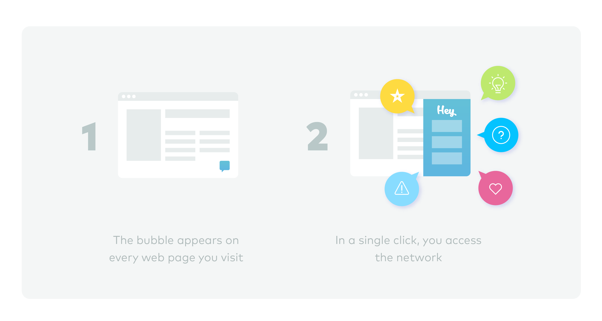

# What is Hey?

Hey is freedom of speech reinvented for everyone, everywhere on the web, at every moment. Because, in 2018, the Internet does not need more information. It needs a better structure.

In practice, Hey is a web application allowing users to share and comment on website content right where it is and without restriction.

By injecting code into every web page, we are able to provide users with a social network embedded into the very same page they are browsing. That way, they can ask each other for advice, read and write reviews, or share tips and insider information–all before they buy a product, use a service, or make a decisions.

Hey works as an extension users install on their browser, or as a widget webmasters install on their own websites.

It functions as an additional layer on top of the page—a discussion just one click away. That way, if users want to comment on content, whether a website owner has provided a platform or not, they can. This is how Hey makes total transparency a reality for every user and publisher.

Once you've added the Hey extension to your brower, its icon will appear in the corner of every page you visit. Clicking the icon opens our application, allowing users to comment on content and communicate with each other. Interactions are saved and displayed on the associated page.

Want to take part in a debate? One click takes you to conversations in Hey, where you can comment or ask questions. Each time other users react to your post, you will receive a notification via email as well as within the extension. Notifications will be grouped in order to avoid overload and can be shut off entirely based on user preference. Within the platform, you can debate ideas, report abuse, share tips, or ask for additional information in all sorts of situations.

In this way, Hey provides an inclusive experience, allowing all users to socialize everywhere on the web at any time.

Here’s how it looks:

Hey also plans to introduce a reward system in order to redistribute the value created by users \(detailed further\). The combination of Hey's innovative software and blockchain technology allows this redistribution process to be efficient and equitable. Each token we issue will help us build a predictable and transparent revenue system that is incorruptible thanks to blockchain technology.

But wait, there’s more. The tokens also serve as incentive for users to create valuable content that grows the community. The larger and more reliable the network, the more likely advertisers are to buy space on the platform. Advertising profits are redistributed to Hey users via tokens, which can be used internally or traded on exchange platforms.

HEY tokens will thus guarantee transparent remuneration for its users while stimulating interactivity. The token will help sustain steady growth as well as user acquisition and engagement, gaining quick momentum as it grows into millions of discussion threads on millions of web pages about millions of topics.  

